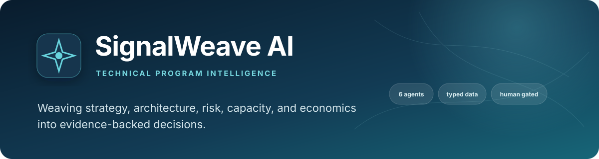
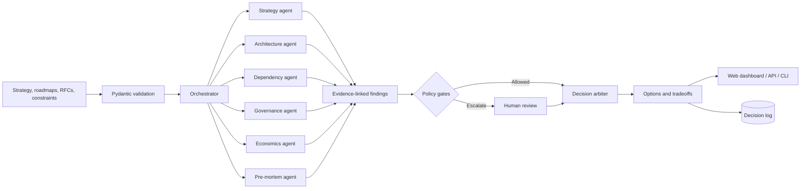
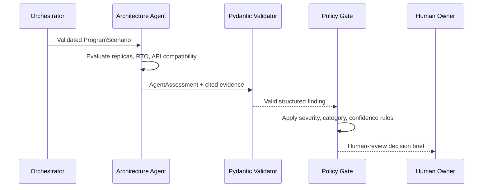

<div align="center">



# SignalWeave AI

### Weaving strategy, architecture, risk, capacity, and economics into evidence-backed decisions.

**A human-governed, multi-agent program intelligence platform powered by the Northstar Decision Engine.**

[](https://www.python.org/)
[](#architecture)
[](docs/adr/001-human-governed-orchestration.md)
[](#quick-start)
[](#testing)
[](LICENSE)

</div>

SignalWeave turns strategy, roadmaps, architecture constraints, staffing assumptions, and risk signals into a shared program model. Six specialized agents challenge the plan from different angles, deterministic policy code governs the result, and leaders receive comparable **continue, mitigate, redirect, buy, or stop** options with explicit evidence and tradeoffs.

> **Portfolio project notice:** SignalWeave is an independent demonstration project. It is not affiliated with, built for, or based on confidential information from any employer. Every organization, artifact, cost, outcome, and person in the repository is synthetic.

**Explore:** [Competencies](#competencies-demonstrated) · [Architecture](#architecture) · [Agent example](#how-a-subagent-works) · [Data](#synthetic-demonstration) · [Dashboard](#professional-htmlcss-dashboard) · [Setup](#quick-start) · [Security](#security-and-responsible-ai) · [Contact](#contact)

## Executive summary

| Question | Answer |
|---|---|
| **What is it?** | A program decision control plane that finds cross-team, architectural, governance, capacity, and investment risk before it becomes delivery failure. |
| **Why build it?** | Traditional dashboards report status by team; complex programs fail in the seams between those teams. SignalWeave analyzes the seams. |
| **How does it work?** | Typed inputs fan out to six narrow agents. Their evidence-linked findings pass through deterministic policy gates before an arbiter creates human-owned decision options. |
| **Who benefits?** | Staff TPMs, engineering and product leaders, portfolio owners, security/privacy partners, and executive sponsors. |
| **What makes it different?** | AI expands the analysis, but cannot bypass validation, policy, or accountable human approval. It also runs completely offline. |

## Competencies demonstrated

SignalWeave is organized around observable engineering and program-leadership competencies. Each claim below points to an artifact that can be inspected, executed, or tested.

| Competency | Demonstrated through | Evidence in this repository |
|---|---|---|
| **Strategic program framing** | Objectives, weighted outcomes, initiative alignment, and explicit constraints | `contracts.py`, Strategy Agent, synthetic portfolio |
| **Cross-domain technical integration** | API compatibility analysis, service resilience, dependency sequencing, and SPOF detection | Architecture and Execution agents |
| **Scalable operating models** | Repeatable specialist contracts, orchestration workflow, policy gates, and decision cadence | Orchestrator, policy engine, architecture ADR |
| **Risk and governance leadership** | Severity thresholds, confidence rules, privacy/security blocks, external-processing controls, and human escalation | Governance Agent, `policy.py`, security documentation |
| **Portfolio and investment judgment** | Cost/value comparison, capacity pressure, build-versus-buy signals, and continue/mitigate/stop options | Economics Agent, arbiter, dashboard charts |
| **Applied AI systems engineering** | Provider isolation, structured outputs, deterministic fallback, retry/timeout configuration, and safe degradation | `providers.py`, Pydantic contracts, mocked-provider tests |
| **Data-driven decision support** | Reproducible synthetic metrics, risk heatmap, investment chart, dependency graph, and scenario simulation | Example dataset and HTML/CSS/JavaScript dashboard |
| **Quality and delivery discipline** | Forty automated tests, Python 3.11/3.12 CI, strict validation, API failure handling, and offline verification | `tests/`, GitHub Actions workflow |
| **Executive communication** | Evidence-linked findings, concise decision briefs, comparable options, and an auditable disposition trail | Decision report contract and dashboard |

See the [detailed competency map](docs/COMPETENCY_MAP.md) for the design choices and verification evidence behind each area.

## Why it exists

Large programs rarely fail because one team cannot execute a ticket. They fail at the seams: an API ships after its consumer, two roadmaps assume the same scarce engineers, a privacy review starts too late, or a single service silently becomes the critical path. Traditional status dashboards describe these conditions after they happen. SignalWeave is designed to expose them while leaders can still act.

The project demonstrates a Staff-level operating principle: AI can widen the field of analysis, but it should not hide evidence, collapse uncertainty, or automate executive accountability.

> **Related work in this portfolio:** [Tarmac](https://github.com/PlainJane20/tarmac)
> and [tpm-agent-os](https://github.com/PlainJane20/tpm-agent-os) also model
> TPM/portfolio decision-governance territory — worth being upfront about
> rather than presenting each as unrelated. Same underlying interest,
> three different shapes: Tarmac is a web-app governance layer connecting
> Jira/GitHub/ServiceNow-style tools; tpm-agent-os is a lean six-agent
> pipeline modeling the Staff TPM operating model directly; this one is
> the most structurally elaborate of the three — a policy-gated decision
> control plane with a dashboard, aimed specifically at the *seams
> between* teams rather than any one team's status.

## What it does

- Creates a typed, auditable program model from synthetic initiatives, teams, objectives, milestones, dependencies, risks, and capacity.
- Runs specialist analysis for strategy alignment, architecture risk, delivery dependencies, governance, portfolio economics, and pre-mortem failure paths.
- Reconciles agent findings through deterministic policy gates instead of trusting an unconstrained summary.
- Simulates shocks such as an engineering capacity loss or a critical dependency delay.
- Produces multiple decision options with confidence, evidence, owners, and required human approvals.
- Presents the result in an executive-ready dashboard with KPI cards, charts, a dependency graph, scenario comparison, and decision log.
- Runs fully offline with deterministic synthetic data; optional provider adapters can be tested without exposing API keys.

## Who it helps

| Audience | Decision SignalWeave supports |
|---|---|
| Staff / Principal TPMs | Where should leadership intervene across teams? |
| Engineering leaders | Which dependencies, architectural risks, or SPOFs threaten delivery? |
| Product and portfolio leaders | What should continue, redirect, buy, or stop under constrained capacity? |
| Security, privacy, and governance partners | Which decisions require a policy gate or human review? |
| Executive sponsors | What changed, what are the options, and what evidence supports each option? |

## Architecture



The Northstar engine's domain and policy layers are provider-independent. The offline demo uses deterministic analyzers so a reviewer can reproduce every result without network access or API credentials. Any optional LLM integration lives behind an adapter and must return the same validated contracts.

See [Architecture](docs/ARCHITECTURE.md) and [ADR-001: Human-governed agent orchestration](docs/adr/001-human-governed-orchestration.md) for the deeper design rationale.

## How a subagent works

Every agent is deliberately narrow. It receives the same validated scenario but owns one analytical lens and returns the same strict `AgentAssessment` contract.



Example synthetic input:

```json
{
  "id": "SVC-IDENTITY",
  "name": "Identity Gateway",
  "replicas": 1,
  "recovery_time_minutes": 240,
  "contains_phi": false,
  "encryption_at_rest": true,
  "audit_logging": true
}
```

Architecture Agent output:

```json
{
  "id": "ARCH-SPOF-SVC-IDENTITY",
  "category": "single_point_of_failure",
  "severity": "high",
  "title": "Identity Gateway is a deployment single point of failure",
  "confidence": 0.98,
  "requires_human_decision": true,
  "recommendation": "Add multi-zone redundancy, automated failover, and a tested recovery runbook."
}
```

The model or deterministic analyzer does **not** approve a remediation. The policy gate escalates it, the arbiter creates comparable options, and a human owner records the decision. See the [complete agent walkthrough](docs/AGENT_WALKTHROUGH.md).

## Engineering decisions and lessons

- **A control plane should be deterministic.** Models widen analysis; ordinary code owns validation, severity thresholds, block conditions, and approval routing.
- **Evidence must be structurally required.** `Finding.evidence` cannot be empty, preventing an agent from returning a confident recommendation with no traceable source.
- **Broken references should fail early.** Scenario validation resolves team, objective, initiative, service, dependency, and API-consumer IDs before specialists run.
- **Offline mode is a product path, not a test shortcut.** The complete workflow, dashboard, metrics, and decision report work without a network or provider key.
- **One opaque score is not a decision.** SignalWeave presents multiple actions with cost, value, confidence, and modeled risk reduction so uncertainty stays visible.
- **Sensitive-data authorization must be explicit twice.** A potentially sensitive scenario needs both scenario-level and environment-level approval before external processing.

## Synthetic demonstration

The bundled scenario models a fictional digital marketplace coordinating multiple product and platform teams. It deliberately contains a late platform API, shared specialist capacity, an architectural single point of failure, and a governance review dependency.

The checked-in scenario currently produces these deterministic values:

| Synthetic demo measure | Deterministic output | Interpretation |
|---|---:|---|
| Specialist assessments | 6 | One result from each narrow analyzer |
| Evidence-linked findings | 9 | Seven are high or critical |
| Capacity utilization | 105.9% | Synthetic demand exceeds supplied team capacity |
| Modeled annual cost | $4.60M | Sum of fictional initiative inputs |
| Modeled annual value | $9.50M | Illustrative input, not a forecast |
| Modeled cost delta | $487K | Difference after applying recommended option costs |
| Decision options | 13 | Comparable actions across five initiatives |

**These are generated demonstration values, not measured business results, predictions, benchmarks, or claims about a real organization.** Model scores are decision aids; they are only as sound as their inputs and assumptions.

## Repository map

```text
.
├── src/northstar/
│   ├── agents/           # Narrow specialist analyzers
│   ├── web/              # Dashboard HTML/CSS/JavaScript assets
│   ├── contracts.py      # Strict cross-agent Pydantic models
│   ├── orchestrator.py   # Workflow and aggregation
│   ├── policy.py         # Deterministic gates
│   ├── arbiter.py        # Decision options and metrics
│   ├── providers.py      # Offline and optional hosted adapters
│   ├── cli.py            # Command-line entry point
│   └── server.py         # Local dashboard and JSON API
├── examples/             # Reproducible synthetic portfolio
├── tests/                # Unit, policy, provider, and end-to-end tests
├── .github/workflows/    # Python 3.11/3.12 continuous integration
└── docs/                 # Architecture, methodology, and decision records
```

## Quick start

Requirements:

- Python 3.11+
- A modern browser
- No API keys for offline/demo mode

```bash
python3.11 -m venv .venv
source .venv/bin/activate
python -m pip install -e '.[dev]'
pytest
```

Run the representative offline workflow:

```bash
northstar \
  --scenario examples/synthetic_portfolio.json \
  --provider offline \
  --output report.json
```

Start the local dashboard/API:

```bash
python -m northstar.server
```

Then open [http://127.0.0.1:8765](http://127.0.0.1:8765). Use the dashboard to select a shock, compare decision options, and inspect the evidence trail. The browser UI includes a resilient built-in synthetic view and can submit compatible scenarios to the local analysis API.

> The exact module commands above are the supported package entry points. If you are reading this before installation, run them from the repository root after completing the editable install.

## Configuration

Copy `.env.example` as a reference, but export values through your shell or deployment secret manager; the application does not parse `.env` files automatically.

| Variable | Default | Purpose |
|---|---|---|
| `NORTHSTAR_PROVIDER` | `offline` | Selects deterministic `offline` or optional `openai` analysis |
| `OPENAI_API_KEY` | unset | Required only when the provider is `openai` |
| `NORTHSTAR_OPENAI_MODEL` | `gpt-5.4-mini` | Configurable hosted model name |
| `NORTHSTAR_OPENAI_TIMEOUT_SECONDS` | `30` | Provider request timeout |
| `NORTHSTAR_OPENAI_MAX_RETRIES` | `2` | SDK retry limit |
| `NORTHSTAR_ALLOW_SENSITIVE_EXTERNAL` | `false` | Additional explicit control for potentially sensitive external processing |

To experiment with the optional adapter:

```bash
python -m pip install -e '.[openai,dev]'
export NORTHSTAR_PROVIDER=openai
export OPENAI_API_KEY='set-this-in-your-secret-manager'
```

The server rejects external processing for non-synthetic or PHI-bearing scenarios unless both the scenario and environment explicitly authorize it. Do not use the portfolio demo to process real sensitive data.

## API example

```bash
curl -s http://127.0.0.1:8765/api/health

curl -s http://127.0.0.1:8765/api/report

curl -s -X POST http://127.0.0.1:8765/api/analyze \
  -H 'content-type: application/json' \
  --data-binary @examples/synthetic_portfolio.json
```

Every response uses typed contracts and includes traceable finding IDs. Invalid severities, confidence values outside `0..1`, missing evidence, and malformed scenario inputs are rejected at the boundary.

## Professional HTML/CSS dashboard

The dependency-free interface in `src/northstar/web/` is designed for an executive program review and works without a CDN or JavaScript framework. It includes responsive desktop/mobile layouts, keyboard navigation, reduced-motion support, safe output escaping, and an offline fallback dataset.

## What the dashboard explains

- **KPI cards** summarize portfolio health without pretending a score is ground truth.
- **Dependency graph** makes cross-team critical paths and SPOFs visible.
- **Risk distribution chart** separates severity from raw volume.
- **Capacity chart** compares demand with available team capacity.
- **Scenario comparison** shows baseline and counterfactual outcomes side by side.
- **Decision options** expose tradeoffs, confidence, evidence, and approval requirements.
- **Audit log** records what a person selected and why.

## Security and responsible AI

- Offline mode is the default and requires no secrets or external calls.
- Secrets, if optional adapters are enabled, come only from environment variables and are never committed.
- Logs use identifiers and aggregate signals; they should not include raw sensitive text.
- Input contracts reject unexpected shapes and normalize bounded numeric fields.
- High-impact, low-confidence, privacy, security, and irreversible decisions are escalated for human review.
- Agent output is treated as untrusted data until schema validation and policy evaluation succeed.
- Synthetic examples contain no company-confidential information, production credentials, PHI, or personal data.

SignalWeave is a portfolio decision aid, not a medical, legal, compliance, financial, staffing, or production change authority. See [Security and limitations](docs/SECURITY.md).

## Testing

```bash
pytest -q
pytest --cov=northstar --cov-report=term-missing
```

The suite covers:

- strict request/response validation;
- specialist agent outputs and evidence traceability;
- severity, confidence, and human-review gates;
- deterministic baseline and shock scenarios;
- full offline orchestration;
- provider success, malformed output, timeout, and failure behavior using mocks;
- web/API smoke behavior where available.

No test requires a real provider credential or network connection.

GitHub Actions runs the complete suite on Python 3.11 and 3.12 for every push and pull request.

The repository contains **40 tests**. Socket-based HTTP tests skip automatically only when a restricted execution environment prevents binding localhost; they run normally on a developer machine. The supported runtime is Python 3.11 or newer.

## Design limitations and next steps

- Synthetic weights and scores are illustrative, not statistically calibrated.
- A dependency graph cannot capture every political, contractual, or organizational constraint.
- Deterministic agents favor reproducibility over natural-language breadth.
- Optional model output can be incomplete or wrong and must remain schema-validated and reviewable.
- Production use would require identity, authorization, retention controls, observability, red-team evaluation, calibrated scoring, and organization-specific policy review.

The next meaningful extension is not “more agents.” It is evaluation: replaying historical program decisions, measuring finding precision and recall, calibrating confidence, and testing whether recommendations improve real decision quality.

## Contact

<div align="center">

### **Navi Sohi**

*Technical Program Manager & Automation Engineer*

[](https://www.linkedin.com/in/navisohi/)
[](https://github.com/PlainJane20)
[](mailto:nks.ai.dev@gmail.com)

</div>

## License

MIT. See [LICENSE](LICENSE).
