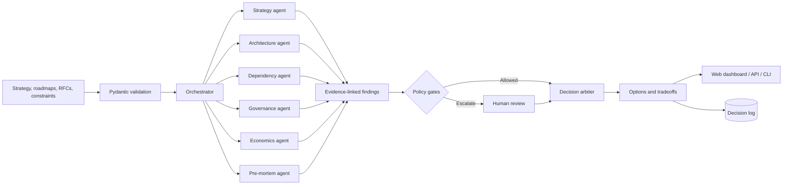

# Northstar Decision Lab

**An evidence-linked, human-governed decision simulator for complex technical programs.**

Northstar turns strategy, roadmaps, architecture constraints, staffing assumptions, and risk signals into a shared program model. A team of specialized AI agents analyzes that model, challenges the plan, and presents several **continue, redirect, buy, or stop** options with explicit tradeoffs. The final decision always remains with a person.

> Portfolio project notice: Northstar is an independent demonstration project. It is not affiliated with, built for, or based on confidential information from any employer. All included organizations, artifacts, people, costs, and outcomes are synthetic.

## Why it exists

Large programs rarely fail because one team cannot execute a ticket. They fail at the seams: an API ships after its consumer, two roadmaps assume the same scarce engineers, a privacy review starts too late, or a single service silently becomes the critical path. Traditional status dashboards describe these conditions after they happen. Northstar is designed to expose them while leaders can still act.

The project demonstrates a Staff-level operating principle: AI can widen the field of analysis, but it should not hide evidence, collapse uncertainty, or automate executive accountability.

## What it does

- Creates a typed, auditable program model from synthetic initiatives, teams, objectives, milestones, dependencies, risks, and capacity.
- Runs specialist analysis for strategy alignment, architecture risk, delivery dependencies, governance, portfolio economics, and pre-mortem failure paths.
- Reconciles agent findings through deterministic policy gates instead of trusting an unconstrained summary.
- Simulates shocks such as an engineering capacity loss or a critical dependency delay.
- Produces multiple decision options with confidence, evidence, owners, and required human approvals.
- Presents the result in an interview-ready dashboard with KPI cards, charts, a dependency graph, scenario comparison, and decision log.
- Runs fully offline with deterministic synthetic data; optional provider adapters can be tested without exposing API keys.

## Who it helps

| Audience | Decision Northstar supports |
|---|---|
| Staff / Principal TPMs | Where should leadership intervene across teams? |
| Engineering leaders | Which dependencies, architectural risks, or SPOFs threaten delivery? |
| Product and portfolio leaders | What should continue, redirect, buy, or stop under constrained capacity? |
| Security, privacy, and governance partners | Which decisions require a policy gate or human review? |
| Executive sponsors | What changed, what are the options, and what evidence supports each option? |

## Architecture



The domain and policy layers are provider-independent. The offline demo uses deterministic analyzers so a reviewer can reproduce every result without network access or API credentials. Any optional LLM integration lives behind an adapter and must return the same validated contracts.

See [Architecture](docs/ARCHITECTURE.md) and [ADR-001: Human-governed agent orchestration](docs/adr/001-human-governed-orchestration.md) for the deeper design rationale.

## Synthetic demonstration

The bundled scenario models a fictional digital marketplace coordinating multiple product and platform teams. It deliberately contains a late platform API, shared specialist capacity, an architectural single point of failure, and a governance review dependency.

The checked-in scenario currently produces these deterministic values:

| Synthetic demo measure | Deterministic output | Interpretation |
|---|---:|---|
| Specialist assessments | 6 | One result from each narrow analyzer |
| Evidence-linked findings | 9 | Seven are high or critical |
| Capacity utilization | 105.9% | Synthetic demand exceeds supplied team capacity |
| Modeled annual cost | $4.60M | Sum of fictional initiative inputs |
| Modeled annual value | $9.50M | Illustrative input, not a forecast |
| Modeled cost delta | $487K | Difference after applying recommended option costs |
| Decision options | 13 | Comparable actions across five initiatives |

**These are generated demonstration values, not measured business results, predictions, benchmarks, or claims about a real organization.** Model scores are decision aids; they are only as sound as their inputs and assumptions.

## Repository map

```text
.
├── src/northstar/
│   ├── agents/           # Narrow specialist analyzers
│   ├── web/              # Dashboard HTML/CSS/JavaScript assets
│   ├── contracts.py      # Strict cross-agent Pydantic models
│   ├── orchestrator.py   # Workflow and aggregation
│   ├── policy.py         # Deterministic gates
│   ├── arbiter.py        # Decision options and metrics
│   ├── providers.py      # Offline and optional hosted adapters
│   ├── cli.py            # Command-line entry point
│   └── server.py         # Local dashboard and JSON API
├── examples/             # Reproducible synthetic portfolio
├── tests/                # Unit, policy, provider, and end-to-end tests
├── .github/workflows/    # Python 3.11/3.12 continuous integration
└── docs/                 # Architecture, methodology, and decision records
```

## Quick start

Requirements:

- Python 3.11+
- A modern browser
- No API keys for offline/demo mode

```bash
python3.11 -m venv .venv
source .venv/bin/activate
python -m pip install -e '.[dev]'
pytest
```

Run the representative offline workflow:

```bash
northstar \
  --scenario examples/synthetic_portfolio.json \
  --provider offline \
  --output report.json
```

Start the local dashboard/API:

```bash
python -m northstar.server
```

Then open [http://127.0.0.1:8765](http://127.0.0.1:8765). Use the dashboard to select a shock, compare decision options, and inspect the evidence trail. The browser UI includes a resilient built-in synthetic view and can submit compatible scenarios to the local analysis API.

> The exact module commands above are the supported package entry points. If you are reading this before installation, run them from the repository root after completing the editable install.

## Configuration

Copy `.env.example` as a reference, but export values through your shell or deployment secret manager; the application does not parse `.env` files automatically.

| Variable | Default | Purpose |
|---|---|---|
| `NORTHSTAR_PROVIDER` | `offline` | Selects deterministic `offline` or optional `openai` analysis |
| `OPENAI_API_KEY` | unset | Required only when the provider is `openai` |
| `NORTHSTAR_OPENAI_MODEL` | `gpt-5.4-mini` | Configurable hosted model name |
| `NORTHSTAR_OPENAI_TIMEOUT_SECONDS` | `30` | Provider request timeout |
| `NORTHSTAR_OPENAI_MAX_RETRIES` | `2` | SDK retry limit |
| `NORTHSTAR_ALLOW_SENSITIVE_EXTERNAL` | `false` | Additional explicit control for potentially sensitive external processing |

To experiment with the optional adapter:

```bash
python -m pip install -e '.[openai,dev]'
export NORTHSTAR_PROVIDER=openai
export OPENAI_API_KEY='set-this-in-your-secret-manager'
```

The server rejects external processing for non-synthetic or PHI-bearing scenarios unless both the scenario and environment explicitly authorize it. Do not use the portfolio demo to process real sensitive data.

## API example

```bash
curl -s http://127.0.0.1:8765/api/health

curl -s http://127.0.0.1:8765/api/report

curl -s -X POST http://127.0.0.1:8765/api/analyze \
  -H 'content-type: application/json' \
  --data-binary @examples/synthetic_portfolio.json
```

Every response uses typed contracts and includes traceable finding IDs. Invalid severities, confidence values outside `0..1`, missing evidence, and malformed scenario inputs are rejected at the boundary.

## What the dashboard explains

- **KPI cards** summarize portfolio health without pretending a score is ground truth.
- **Dependency graph** makes cross-team critical paths and SPOFs visible.
- **Risk distribution chart** separates severity from raw volume.
- **Capacity chart** compares demand with available team capacity.
- **Scenario comparison** shows baseline and counterfactual outcomes side by side.
- **Decision options** expose tradeoffs, confidence, evidence, and approval requirements.
- **Audit log** records what a person selected and why.

## Security and responsible AI

- Offline mode is the default and requires no secrets or external calls.
- Secrets, if optional adapters are enabled, come only from environment variables and are never committed.
- Logs use identifiers and aggregate signals; they should not include raw sensitive text.
- Input contracts reject unexpected shapes and normalize bounded numeric fields.
- High-impact, low-confidence, privacy, security, and irreversible decisions are escalated for human review.
- Agent output is treated as untrusted data until schema validation and policy evaluation succeed.
- Synthetic examples contain no company-confidential information, production credentials, PHI, or personal data.

Northstar is a portfolio decision aid, not a medical, legal, compliance, financial, staffing, or production change authority. See [Security and limitations](docs/SECURITY.md).

## Testing

```bash
pytest -q
pytest --cov=northstar --cov-report=term-missing
```

The suite covers:

- strict request/response validation;
- specialist agent outputs and evidence traceability;
- severity, confidence, and human-review gates;
- deterministic baseline and shock scenarios;
- full offline orchestration;
- provider success, malformed output, timeout, and failure behavior using mocks;
- web/API smoke behavior where available.

No test requires a real provider credential or network connection.

GitHub Actions runs the complete suite on Python 3.11 and 3.12 for every push and pull request.

The repository contains **40 tests**. Socket-based HTTP tests skip automatically only when a restricted execution environment prevents binding localhost; they run normally on a developer machine. The supported runtime is Python 3.11 or newer.

## Five-minute interview demo

1. **Frame the problem (30 sec):** “Programs fail at organizational and architectural seams. This system finds those seams early.”
2. **Show the baseline (45 sec):** Introduce the fictional marketplace, objectives, teams, launch confidence, and dependency graph.
3. **Reveal hidden risk (60 sec):** Trace the platform API delay through the consumer roadmap to the governance review and launch milestone.
4. **Apply a shock (45 sec):** Remove two platform engineers or delay a dependency; watch critical path, capacity, and confidence change.
5. **Compare decisions (60 sec):** Review continue, redirect, buy, and stop options with costs, evidence, reversibility, and uncertainty.
6. **Demonstrate governance (30 sec):** Show why a high-impact option is gated for a named human owner.
7. **Close (30 sec):** “Agents widen the analysis. Typed evidence and policy gates preserve accountability.”

## Design limitations and next steps

- Synthetic weights and scores are illustrative, not statistically calibrated.
- A dependency graph cannot capture every political, contractual, or organizational constraint.
- Deterministic agents favor reproducibility over natural-language breadth.
- Optional model output can be incomplete or wrong and must remain schema-validated and reviewable.
- Production use would require identity, authorization, retention controls, observability, red-team evaluation, calibrated scoring, and organization-specific policy review.

The next meaningful extension is not “more agents.” It is evaluation: replaying historical program decisions, measuring finding precision and recall, calibrating confidence, and testing whether recommendations improve real decision quality.

## License

MIT. See [LICENSE](LICENSE).
