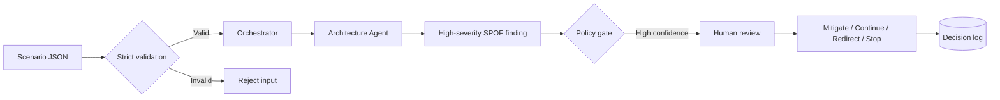

# SignalWeave agent walkthrough

This walkthrough explains one complete decision path through the Northstar Decision Engine. All values are synthetic and reproducible from `examples/synthetic_portfolio.json`.

## Scenario

The fictional Aurora Marketplace portfolio contains five initiatives across four teams. Demand is modeled at 105.9% of quarterly capacity. The Mobile Marketplace Launch depends on Marketplace API v2, while that API change is scheduled without a sufficient compatibility sequence and the Identity Gateway has only one replica.

## Processing flow



## 1. Validated input

`ProgramScenario` rejects unknown fields and broken references before any agent runs. Services, teams, objectives, initiatives, and API consumers must resolve to real IDs in the same scenario.

```json
{
  "id": "SVC-IDENTITY",
  "name": "Identity Gateway",
  "replicas": 1,
  "recovery_time_minutes": 240,
  "contains_phi": false,
  "encryption_at_rest": true,
  "audit_logging": true
}
```

## 2. Narrow specialist analysis

The Architecture Agent owns two concerns only:

- deployment single points of failure;
- cross-team breaking API changes.

In offline mode, deterministic rules make the demonstration reproducible. With the optional OpenAI provider, structured model output must still validate against the identical `AgentAssessment` schema.

```python
if service.replicas < 2:
    severity = Severity.CRITICAL if service.replicas == 0 else Severity.HIGH
```

## 3. Evidence-linked finding

```json
{
  "id": "ARCH-SPOF-SVC-IDENTITY",
  "agent": "architecture",
  "category": "single_point_of_failure",
  "severity": "high",
  "title": "Identity Gateway is a deployment single point of failure",
  "evidence": [
    {
      "source_id": "SVC-IDENTITY",
      "statement": "Service has 1 replica and a 240-minute recovery objective.",
      "metric_value": 1,
      "metric_unit": "replicas"
    }
  ],
  "confidence": 0.98,
  "requires_human_decision": true
}
```

## 4. Deterministic gate

The policy engine—not a prompt—compares severity, category, and confidence with configured thresholds. This high-confidence finding becomes `human_review`. A critical privacy or security finding can produce `block`.

## 5. Comparable decisions

The arbiter produces options rather than a single opaque instruction:

| Option | Modeled effect | Authority |
|---|---|---|
| Continue | Accept observed resilience and sequencing risk | Human approval required |
| Mitigate | Fund redundancy, compatibility, and recovery work | Human approval required |
| Redirect | Reassign constrained capacity from lower-value work | Human approval required |
| Stop | Exit work with negative modeled value or no objective link | Human approval required |

## 6. Portfolio-level output

The full checked-in scenario produces:

| Measure | Deterministic result |
|---|---:|
| Specialist assessments | 6 |
| Evidence-linked findings | 9 |
| High/critical findings | 7 |
| Decision options | 13 |
| Capacity utilization | 105.9% |
| Modeled cost delta | $487K |

These figures describe fictional inputs and deterministic calculations. They are not forecasts, benchmarks, or claims about any real organization.
