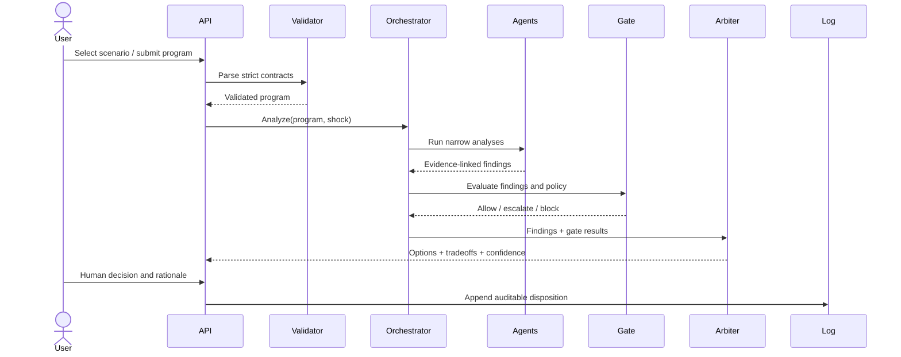
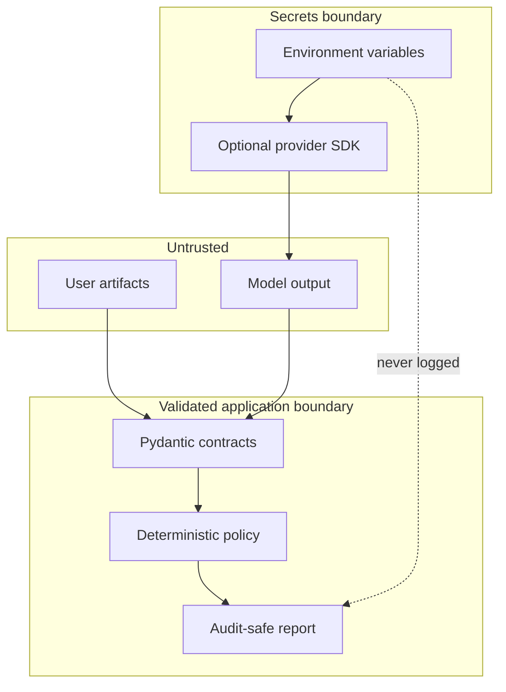

# Architecture

## Design goals

Northstar is built around five properties:

1. **Evidence before prose.** Findings identify the source entities and assumptions that support them.
2. **Determinism at the control plane.** Policy gates and workflow transitions are ordinary code, not prompts.
3. **Typed boundaries.** Every scenario, finding, option, and report is validated before another component consumes it.
4. **Provider independence.** Specialist analysis can be deterministic or model-assisted without changing domain contracts.
5. **Human ownership.** High-impact decisions are recommendations until an accountable person records a disposition.

## Processing model

## Layer responsibilities

| Layer | Owns | Must not own |
|---|---|---|
| Contracts | Data shape, enums, numeric bounds | Business decisions |
| Agents | Narrow analysis and cited findings | Cross-program policy |
| Orchestration | Ordering, fan-out, aggregation | Provider-specific parsing |
| Policy gates | Escalation/block conditions | Free-form recommendations |
| Arbiter | Comparable decision options | Silent approval |
| API/UI | Transport and explanation | Domain logic |
| Provider adapters | SDK calls, timeout/retry, response conversion | Secrets in logs or domain policy |

## Failure behavior

- Invalid input fails before agent execution.
- One specialist failure is represented explicitly; it is never converted to a successful empty result.
- A malformed provider response fails schema validation.
- Provider timeouts and retry exhaustion surface a safe error without request contents or credentials.
- Missing evidence reduces confidence or triggers escalation.
- A blocked policy outcome cannot be overwritten by a model-generated recommendation.
- Offline analysis remains available when no external provider is configured.

## Trust boundaries

## Scoring interpretation

A confidence score is a transparent heuristic over the supplied synthetic facts; it is not a probability of real-world success. The UI should always expose contributing signals, assumptions, and sensitivity to scenario changes. Scores should be compared within the same configured model, not across organizations.
